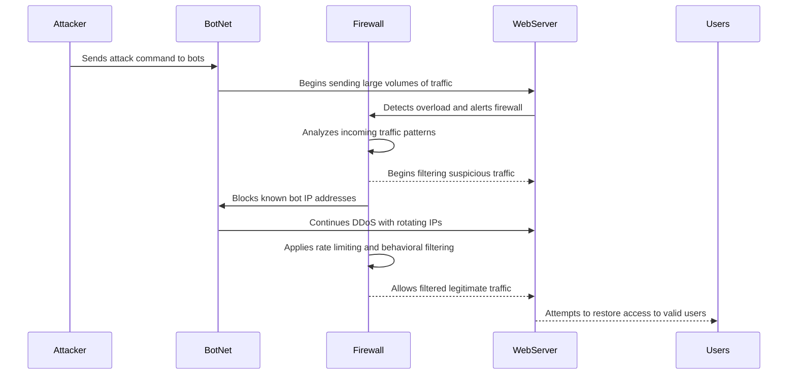

1. In the first step of the sequence diagram, **the Attacker remotely starts the DDoS by sending a command to BotNet to program compromised bots to flood the target server with requests.**
2. **BotNet will then begin to send large volumes of traffic, or "flood" the WebServer** with requests to overwhelm it.
3. The **Server detects atypical traffic,** which triggers Firewall. 
4. **The intrusion detection system, or Firewall, then analyzes traffic patterns to try and identify common DDoS behaviors.**  
5. After analyzing, the **firewall will start filtering out suspicious or malicious activity.** 
6. **With said identified information, the firewall will block any associated with attack, concurrently reducing overall load on the server**  
7. The BotNet, or **Atacker then continues DDoS by using rotating IP addresses or additional bots.**  
8. **Firewall implements rate limiting from data in order to complete more in-depth filtering.**
9. After a more accurate filtering system is put in place, the **firewall allows real users thorugh to the server.** 
10. **After efforts have beeen put in place, the Server starts recovering and responding to valid user requests again.**
